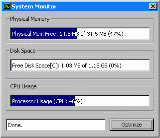



## \[System\_Monitor\]

### Description

Get Free Memory(RAM) of your PC, Get Free Disk Space, Get CPU Usage, Optimize Memory/Free Up Memory space, Custom Progress bar, System Tray Compatible
 
### More Info
 

             |
---                |---
**Submitted On**   |2002-01-09 09:30:14
**By**             |[vex pasia](https://github.com/Planet-Source-Code/PSCIndex/blob/master/ByAuthor/vex-pasia.md)
**Level**          |Advanced
**User Rating**    |3.5 (35 globes from 10 users)
**Compatibility**  |VB 5\.0, VB 6\.0
**Category**       |[Miscellaneous](https://github.com/Planet-Source-Code/PSCIndex/blob/master/ByCategory/miscellaneous__1-1.md)
**World**          |[Visual Basic](https://github.com/Planet-Source-Code/PSCIndex/blob/master/ByWorld/visual-basic.md)
**Archive File**   |[A\_System\_M47329182002\.zip](https://github.com/Planet-Source-Code/vex-pasia-system-monitor__1-30597/archive/master.zip)

